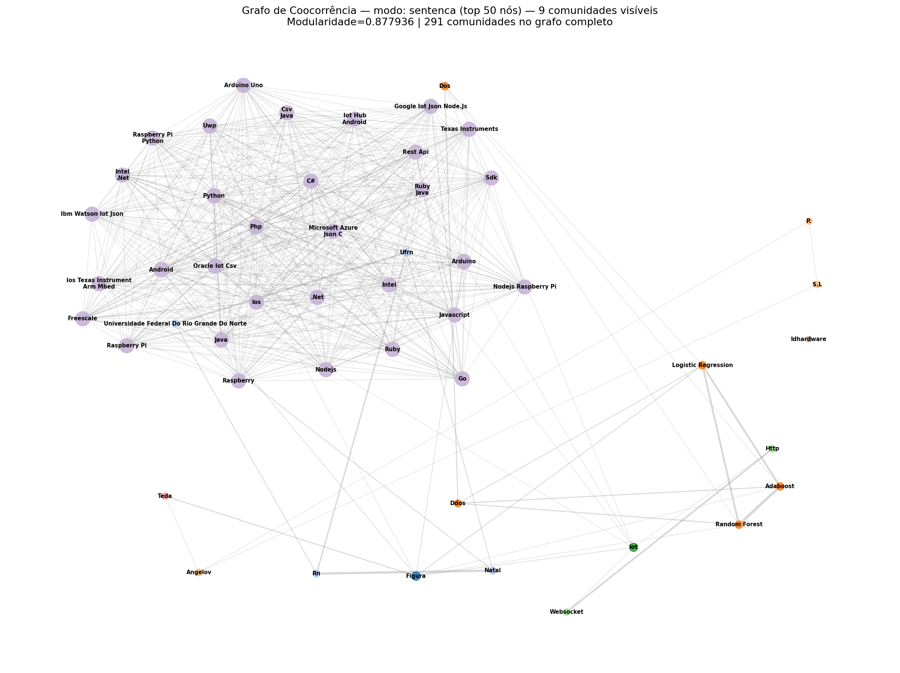
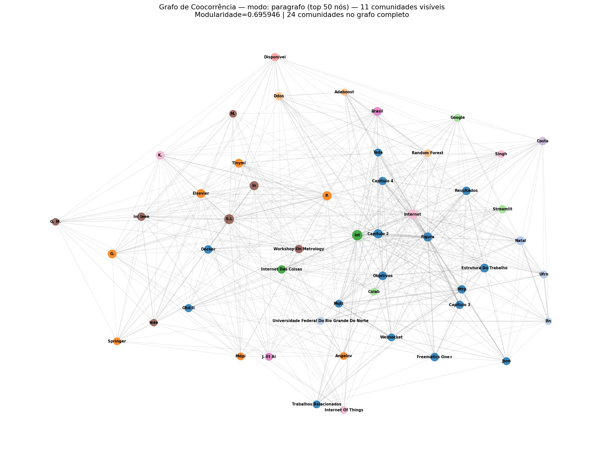
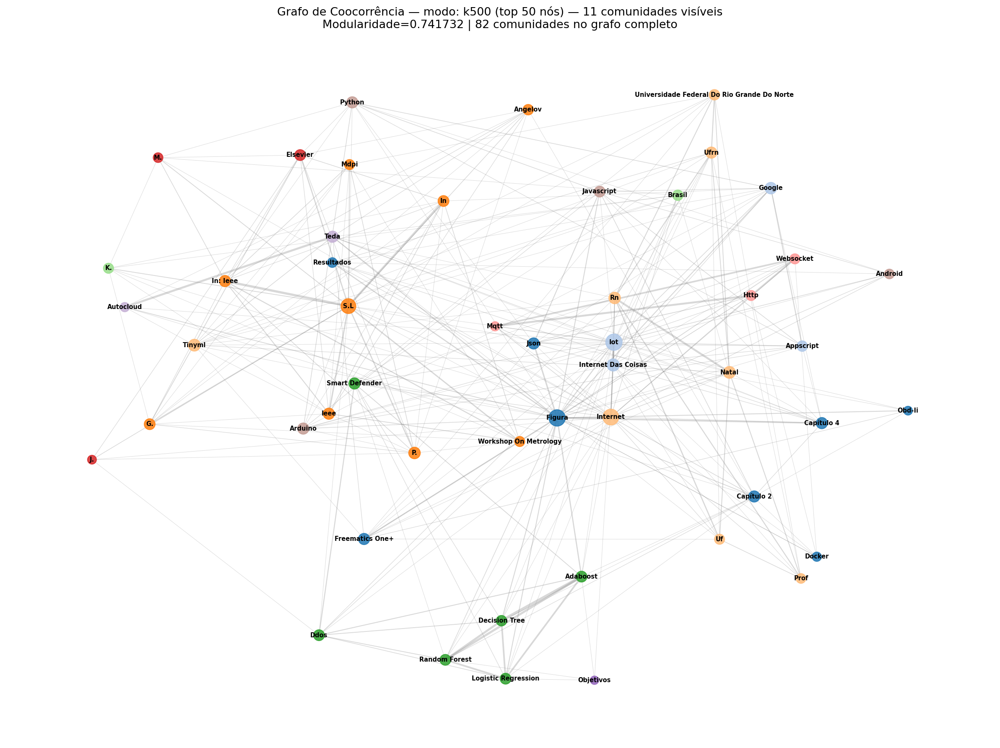
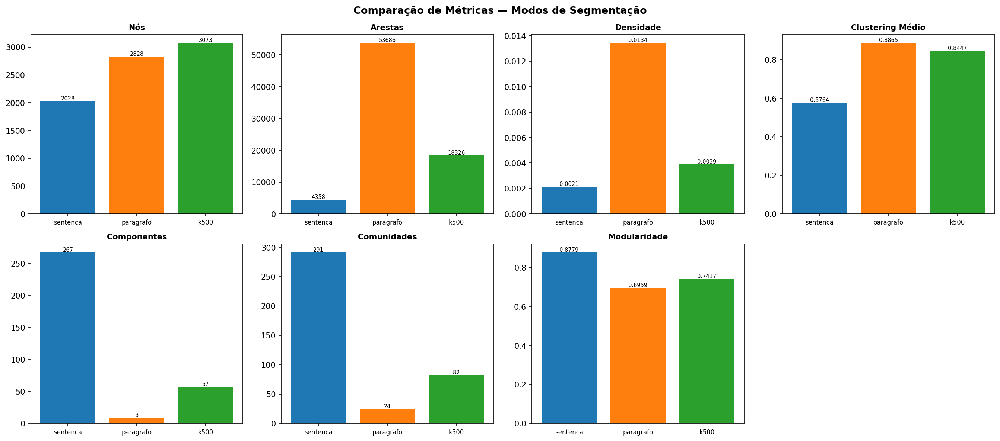
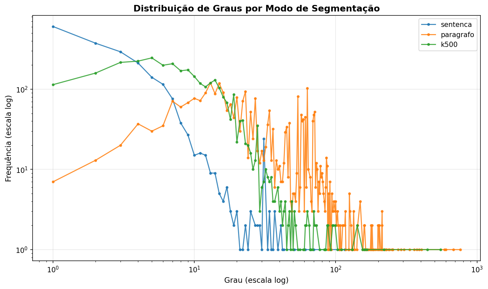
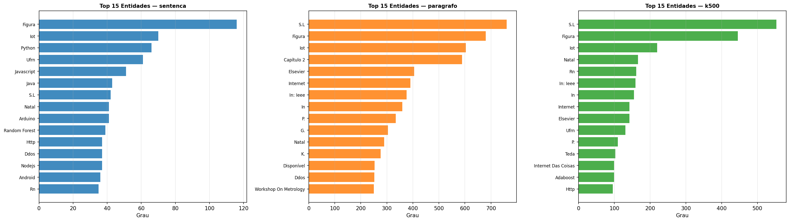
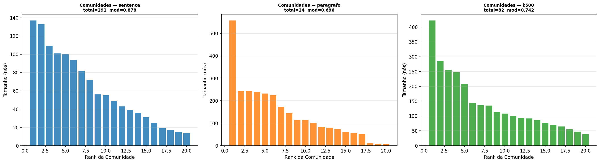

# Grafos de Coocorrência de Entidades Nomeadas em TCCs de Engenharia de Computação

**Disciplina:** Algoritmos e Estruturas de Dados II  
**Curso:** Engenharia de Computação — UFRN

---

## Integrantes

- Matheus Rodrigues Marinho

---

## Vídeo de Apresentação

> 🎥 [Assista à apresentação no Loom](https://www.loom.com/share/XXXXXXXXXXXXXXXX)  
> *(link será adicionado em breve)*

---

## Descrição do Projeto

Este trabalho investiga a estrutura temática de Trabalhos de Conclusão de Curso (TCCs) da área de Engenharia de Computação por meio de **grafos de coocorrência de entidades nomeadas**. A hipótese central é que entidades que aparecem juntas com frequência no texto revelam os temas dominantes e as relações conceituais de cada trabalho.

O pipeline construído parte dos PDFs dos TCCs e percorre as seguintes etapas:

1. **Extração de texto** dos PDFs com `pdfplumber`
2. **Reconhecimento de Entidades Nomeadas (NER)** com o modelo `pt_core_news_lg` do spaCy, identificando pessoas, organizações, locais, tecnologias e outros termos relevantes
3. **Construção do grafo de coocorrência** com NetworkX: cada entidade vira um nó e cada par de entidades que aparece na mesma janela de contexto gera (ou incrementa o peso de) uma aresta
4. **Análise de métricas de rede** — densidade, clustering, componentes conectados, diâmetro
5. **Detecção de comunidades** com o algoritmo de Louvain (ponderado pelo peso de coocorrência)
6. **Geração de figuras comparativas** entre os modos de segmentação

### Modos de segmentação comparados

Um aspecto central do trabalho é comparar como a escolha da **janela de contexto** influencia a estrutura do grafo resultante:

| Modo | Janela de contexto | Característica |
|------|--------------------|----------------|
| `sentenca` | cada sentença do texto | janelas curtas e precisas |
| `paragrafo` | cada parágrafo (blocos separados por linha em branco) | janelas longas com mais contexto |
| `k_chars` | blocos de *k* caracteres consecutivos (padrão k=500) | janela de tamanho fixo |

---

## Atividades Realizadas

### 1. Coleta dos TCCs

Foram coletados **8 TCCs** de Engenharia de Computação da UFRN, cobrindo diferentes subáreas: IoT, aprendizado de máquina, segurança de redes, sistemas embarcados e desenvolvimento web.

### 2. Extração e limpeza de texto

O texto de cada PDF foi extraído página a página com `pdfplumber` e submetido a uma limpeza básica: remoção de quebras de linha múltiplas consecutivas e normalização de espaços. Os textos variam de 47 KB a 108 KB, totalizando ~600 KB.

### 3. Aplicação de NER

Cada texto foi processado pelo modelo `pt_core_news_lg` do spaCy. Foram consideradas as seguintes categorias de entidades:

| Label | Tipo |
|-------|------|
| PER | Pessoas |
| ORG | Organizações |
| LOC / GPE | Locais e entidades geopolíticas |
| MISC / NORP | Entidades diversas e grupos |
| EVENT | Eventos |
| WORK_OF_ART | Obras e produções |

### 4. Construção dos grafos e análise de comunidades

Para cada modo de segmentação foi construído um grafo ponderado e aplicado o algoritmo de Louvain para detectar comunidades temáticas. Os grafos foram visualizados com layout *spring*, nós dimensionados pelo grau e coloridos por comunidade.

### 5. Geração de figuras comparativas

Ao final do pipeline com `--modo todos`, são geradas automaticamente quatro figuras que colocam os três modos lado a lado para análise visual.

---

## Resultados

### Grafos de coocorrência

#### Modo sentença


#### Modo parágrafo


#### Modo k=500 caracteres


---

### Métricas comparativas

| Métrica | Sentença | Parágrafo | k=500 chars |
|---------|----------|-----------|-------------|
| Nós | 2.028 | 2.828 | 3.073 |
| Arestas | 4.358 | 53.686 | 18.326 |
| Densidade | 0,00212 | 0,01343 | 0,00388 |
| Componentes conectados | 267 | 8 | 57 |
| Tamanho do maior componente | 1.253 | 2.791 | 2.884 |
| Diâmetro do maior componente | 15 | 5 | 9 |
| Clustering médio | 0,576 | 0,886 | 0,845 |
| Comunidades (Louvain) | 291 | 24 | 82 |
| Modularidade | **0,878** | 0,696 | 0,742 |

---

### Figuras comparativas

#### Comparação de métricas entre modos


#### Distribuição de graus (escala log-log)


#### Top 15 entidades por grau


#### Distribuição de tamanho das comunidades


---

### Entidades mais centrais por modo

**Modo sentença** (top 10 por grau): Figura (116), IoT (70), Python (66), UFRN (61), Javascript (51), Java (43), Natal (41), Arduino (41), Random Forest (39)

**Modo parágrafo** (top 10 por grau): Figura (680), IoT (603), Natal (290), UFRN (240), Elsevier (405), Random Forest (201), DDoS (252)

**Modo k=500** (top 10 por grau): Figura (445), IoT (220), Natal (166), UFRN (131), Elsevier (142), Random Forest (95), DDoS (95)

---

### Comunidades identificadas (modo sentença)

| Comunidade | Tamanho | Entidades representativas |
|------------|---------|--------------------------|
| 0 | 137 | Figura, OBD-II, Streamlit, Bluetooth |
| 1 | 133 | UFRN, Natal, RN, SIGAA |
| 2 | 109 | Random Forest, DDoS, Logistic Regression, AdaBoost |
| 3 | 101 | referências bibliográficas (S.L, Angelov, P.) |
| 4 | 100 | IoT, Google, AppScript, Internet das Coisas |

---

## Análise e Discussão

### Efeito da janela de contexto na estrutura do grafo

A escolha da janela de contexto tem impacto significativo sobre a estrutura do grafo. O modo **parágrafo** gerou ~12× mais arestas do que o modo **sentença** com apenas 40% mais nós, o que se traduz em uma densidade 6× maior e um grafo muito mais conectado (8 componentes contra 267). Isso ocorre porque parágrafos geralmente contêm múltiplas sentenças sobre o mesmo assunto, amplificando as coocorrências entre entidades relacionadas.

O modo **k=500 caracteres** se posiciona de forma intermediária: mais conectado do que o modo sentença (57 componentes, clustering de 0,845) mas mais fragmentado que o parágrafo. Isso sugere que janelas de tamanho fixo capturam contexto suficiente para identificar coocorrências locais sem o risco de misturar entidades de tópicos muito distintos que apenas compartilham o mesmo parágrafo longo.

### Modularidade e coesão das comunidades

A modularidade foi mais alta no modo sentença (0,878), indicando comunidades mais bem delimitadas e com menos conexões cruzadas. No modo parágrafo, a modularidade cai para 0,696 — ainda assim um valor alto, mas refletindo que janelas longas criam "atalhos" entre comunidades que não existiriam com janelas menores. O modo k=500 obteve modularidade intermediária (0,742).

### Temas identificados nos TCCs

As comunidades encontradas revelam os principais eixos temáticos do corpus:

- **IoT e sistemas embarcados**: IoT, Arduino, OBD-II, Bluetooth, MQTT, Freematics
- **Institucional (UFRN)**: UFRN, Natal, RN, SIGAA, Sistema de Bibliotecas
- **Segurança e aprendizado de máquina**: Random Forest, DDoS, AdaBoost, Logistic Regression, Smart Defender
- **Desenvolvimento web/mobile**: Python, JavaScript, Java, AppScript, Streamlit
- **Referências bibliográficas**: Elsevier, Springer, MDPI, IEEE — grupo "ruidoso" capturado pelo NER

### Limitações

- O NER do spaCy captura ruído relevante de referências bibliográficas (editoras, autores abreviados como "P.", "G."). Esses nós distorcem as métricas de centralidade do modo parágrafo.
- A normalização de entidades é superficial (apenas capitalização). Variações como "UFRN" e "Universidade Federal do Rio Grande do Norte" aparecem como nós distintos.
- Com apenas 8 TCCs, o grafo reflete um corpus pequeno; os resultados devem ser interpretados com cautela.

---

## Como executar

```bash
# Instalar dependências
python -m venv venv && .\venv\Scripts\Activate.ps1
pip install -r requirements.txt
python -m spacy download pt_core_news_lg

# Rodar os três modos e gerar todas as figuras
cd src
python main.py --modo todos

# Personalizar janela k
python main.py --modo k_chars --k-chars 1000

# Filtrar arestas fracas
python main.py --modo todos --peso-minimo 2
```

### Estrutura do projeto

```
trabalho-grafos/
├── data/
│   ├── pdfs/          ← TCCs em PDF (não versionados)
│   └── textos/        ← textos extraídos (não versionados)
├── outputs/
│   ├── grafos/        ← grafos PNG por modo
│   └── figuras/       ← figuras comparativas
├── src/
│   ├── main.py        ← pipeline principal
│   ├── extract_text.py
│   ├── ner_graph.py
│   ├── analysis.py
│   ├── figures.py
│   └── utils.py
└── requirements.txt
```
